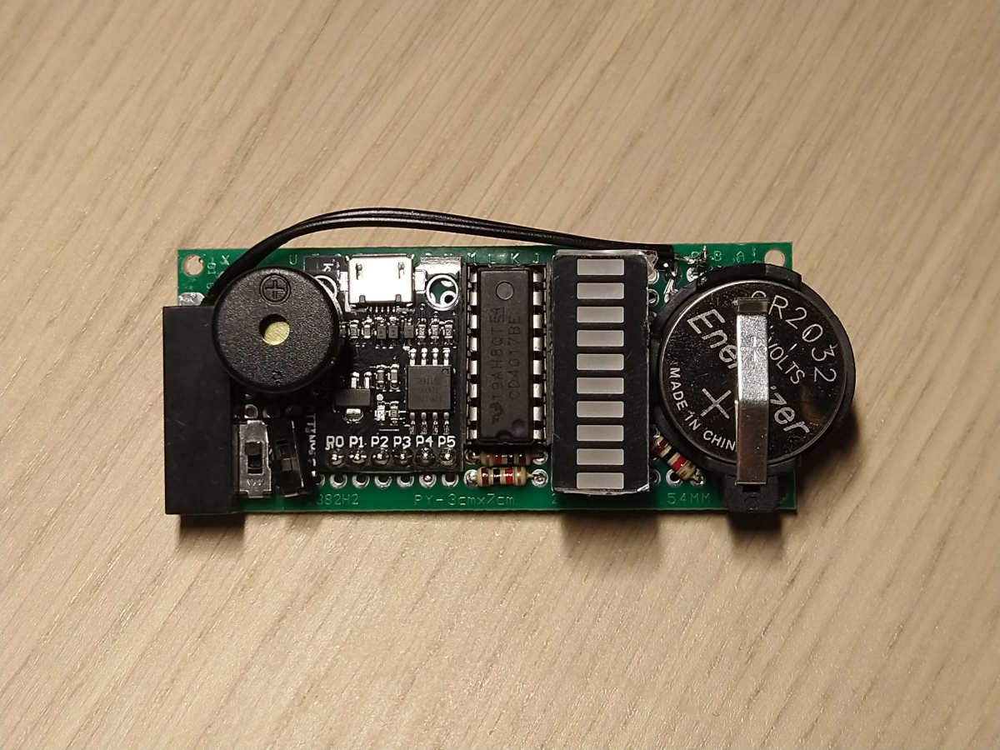
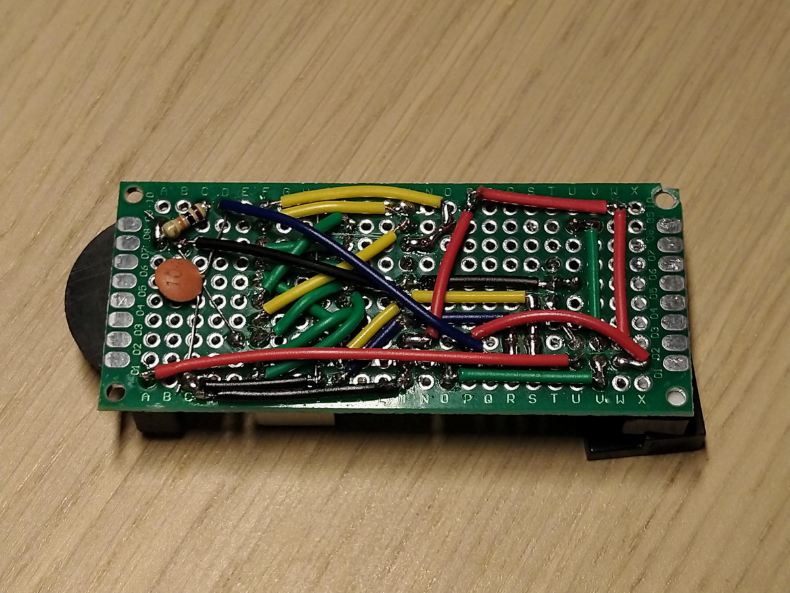
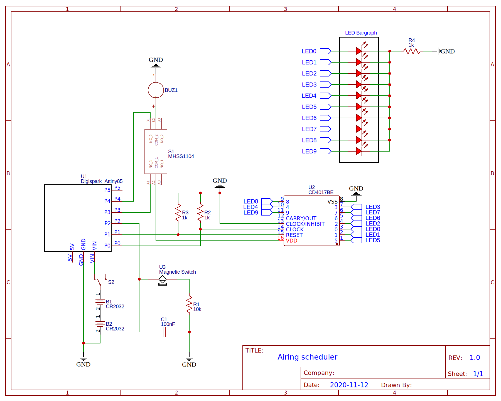

# Airing scheduler

Scheduler reminds you to close windows when you're letting some fresh air into the room. Built on Digispark ATTINY85, powered from two CR2032 batteries.

Device on prototyping board:

    
    

Schematic:

    

